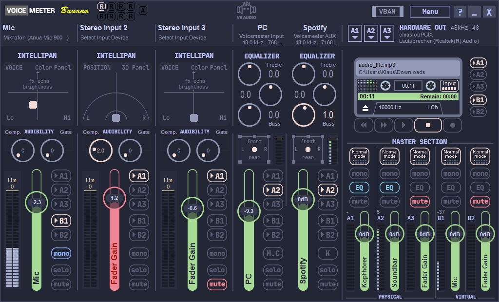

# Catppuccin Macchiato for Voicemeeter
### (currently only Banana)


Voicemeeter theme that uses the [Catppuccin Macchiato](https://github.com/catppuccin/catppuccin) color palette.

## Usage

This theme is meant to be used with the [VoiceMeeter Chroma](https://github.com/emkaix/voicemeeter-chroma) mod.

1. [Download the theme from the Release page.](https://github.com/emkaix/voicemeeter-theme-catppuccin-macchiato/releases)
2. Copy the `themes` folder to `C:\Users\<USER>\Documents\Voicemeeter\`
3. You should now have:

```
C:\Users\<USER>\Documents\Voicemeeter\themes\catppuccin_macchiato\colors.yaml
C:\Users\<USER>\Documents\Voicemeeter\themes\catppuccin_macchiato\banana\bg.bmp
C:\Users\<USER>\Documents\Voicemeeter\themes\catppuccin_macchiato\banana\bg_settings.bmp
C:\Users\<USER>\Documents\Voicemeeter\themes\catppuccin_macchiato\banana\bg_cassette.bmp

```
4. Set the theme in `vmchroma.yaml`:

```
theme:
  banana: catppuccin_macchiato
  potato: 
  default:

(...)
```
> [!IMPORTANT]  
> Make sure to include the single space after `:`

5. Launch Voicemeeter with the [VoiceMeeter Chroma](https://github.com/emkaix/voicemeeter-chroma) mod.
